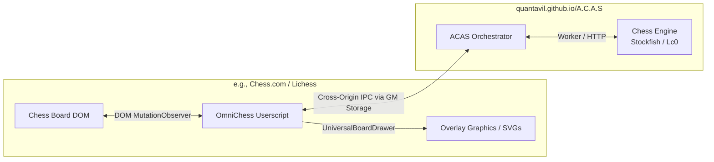

# OmniChess

OmniChess is a modular, high-performance chess assistance userscript that provides real-time strategy visualization, move analysis, and automated move-playing capabilities. It overlays assistance directly on major chess platforms (such as Chess.com and Lichess) and interacts with a centralized engine backend.

---

## ❤️ Credits
This project is a modularized, optimized, and heavily enhanced fork of the original [A.C.A.S Userscript by HKR/Psyyke](https://greasyfork.org/en/scripts/459137-1-chess-assistant-a-c-a-s-advanced-chess-assistance-system).

## 🌟 Key Enhancements & Changes
Unlike the original monolithic userscript, our fork introduces several key structural and functional improvements:

1. **Modular Architecture & Build System:**
   * Restructured the monolithic `~2000` line script into clean ES6 modular folders under `src/` (e.g. `core/`, `adapters/`, `utils/`, `drawing/`) built and compiled using the ultra-fast **Bun** bundler.
2. **In-house CommLink IPC Module:**
   * Removed external remote `@require` library dependencies. The cross-origin communication coordinator is now fully local and embedded in `src/core/comm.js` with parallelized storage reads (`Promise.all`), increasing speed, safety, and offline stability.
3. **Advanced Anti-Cheat & Mouse Simulation:**
   * **Natural (Hybrid) Moves:** Dynamically alternates between click-only and drag-and-drop moves to mimic human variability.
   * **Bezier Curve Paths:** Drag paths are dynamically bent along quadratic Bezier curves with randomized jitters instead of executing straight lines.
   * **Jittered Click Delay Variance:** Delays between down and up clicks are randomized between `40ms` and `110ms` to mimic natural key release times.
   * **Speed Profiles:** Integrated speed presets (`fast-flicker`, `slow-steady`, `tired-drag`) to randomize drags.
   * **Event Verification:** Inspects `e.isTrusted` to ignore programmatic inputs and prevent infinite loops.
4. **Active Self-Healing Auto-Moves:**
   * Implemented a recovery routine that checks if a move failed to update the FEN, retrying up to 3 times (with a 1.5s timeout) to prevent automation freezes.
5. **Adaptive Depth Scaling:**
   * Implemented player-relative search depth scaling (depth 6 to 14 mapped dynamically to engine evaluations between +5 and -5) to speed up easy wins and think deeper during complex losses.
6. **Modernized Internals:**
   * Replaced legacy UUID generation strings with native `crypto.randomUUID()`.

---

## 🚀 How it Works

OmniChess uses a distributed, client-backend architecture split into two main components: the **Frontend Userscript Client** and the **Engine Backend GUI**.



### 1. The Userscript (Frontend Client)
The userscript runs directly on the active chess tab. Its main responsibilities include:
* **Board & State Scrape:** Scrapes and watches the chessboard DOM elements using site-specific adapters (`src/adapters/`).
* **FEN Generation:** Converts visual board placements (CSS translation metrics, transforms) into standard FEN (Forsyth-Edwards Notation) strings in real time.
* **Move Detection:** Monitors moves made by both players using a `MutationObserver` on the board container and a fallback polling routine.
* **Visual Rendering:** Highlights squares, overlays directional paths, and displays move ratings (best/alternative moves) using the `UniversalBoardDrawer` overlay.
* **Auto-Play:** Triggers programmatic pointer and mouse events to click, drag-and-drop, or alternate between them using "Natural (Hybrid)" mode (with Bezier curved trajectories) to automate playing the suggested engine move (if configured).

### 2. The Engine Backend (GUI)
The engine runs inside the **ACAS GUI tab** (defaulting to the hosted [quantavil.github.io/A.C.A.S/app/](https://quantavil.github.io/A.C.A.S/app/) page or `localhost` during development).
* **Where the engine comes from:**
  * **Web-Assembly (Wasm) Engines:** By default, ACAS runs chess engines like **Stockfish.js** or **Lc0** directly inside the browser using Web Workers. This means the engine runs locally inside the user's browser without requiring any local executable installation.
  * **Native Engines:** For players needing high depths, multi-threading, or GPU acceleration, the GUI can connect to a local native helper server running on the host system. This server hooks into local, compiled native chess engine executables (like Stockfish binary or Lc0 running on CUDA).
* The GUI page also contains the dashboard to configure engine depth/nodes, select engine profiles, fine-tune auto-move intervals (with options for click, drag, or natural hybrid moves), and customize visuals.

### 3. The Communication Bridge (`CommLink`)
Because the chess tab (e.g., `chess.com`) and the ACAS backend tab (`quantavil.github.io`) are hosted on different domains, browser sandboxing prevents them from calling each other directly.

OmniChess bypasses this using **Userscript Storage (Greasemonkey API)** as a shared IPC (Inter-Process Communication) channel:
1. When a new board state is detected, the userscript writes a packet prefixed with `commlink-packet-` (containing the current FEN, orientation, variant, etc.) into Greasemonkey storage (`GM_setValue`).
2. The ACAS backend GUI page constantly polls for new packets, reads the FEN, evaluates the best move using the chess engine, and updates the packet in GM storage with the result.
3. The userscript polls the same storage, reads the best move results, deletes the packet to clean up, and visually highlights/plays the moves.
4. If the userscript doesn't detect a running backend, it automatically opens the ACAS GUI page in a new background tab (`GM_openInTab`) to initialize the engine.

---

## 📂 Project Structure

* **`src/`**: Modular source code files.
  * **`src/core/`**: Orchestration logic (main controller `index.js`, automation handler `autoMove.js`, and `comm.js` for the GM Storage IPC handler).
  * **`src/adapters/`**: Platform-specific selectors (supporting `chess.com`, `lichess.org`, `playstrategy.org`, `pychess.org`, `worldchess.com`, `gameknot.com`).
  * **`src/drawing/`**: Screen rendering overlays and SVGs (`drawing.js`).
  * **`src/utils/`**: Configuration managers (`config.js`), coordinate transformation math (`coordinates.js`), and helper utilities.
* **`dist/main.js`**: Compiled single-file userscript that gets loaded by Tampermonkey/Violentmonkey.
* **`tests/`**: Unit tests verifying geometric coordinate conversions.
* **`build.js`**: Bundling script utilizing the fast Bun bundler.

---

## 🛠️ Build and Development

### Prerequisites
Make sure you have [Bun](https://bun.sh/) installed.

### Installation
Installs dev dependencies (e.g. `dependency-cruiser` for tracking import boundaries):
```bash
bun install
```

### Building the Userscript
Bundle the modular source files under `src/` and prepend the userscript metadata:
```bash
bun run build
```
This output is written to `dist/main.js`. Copy this file into your userscript manager (Tampermonkey, Violentmonkey) to use or test changes.

### Running Tests
Verify coordinate conversions:
```bash
bun test
```

### Static Analysis
Analyze circular dependencies and check import safety boundaries:
```bash
bun run lint:imports
```
