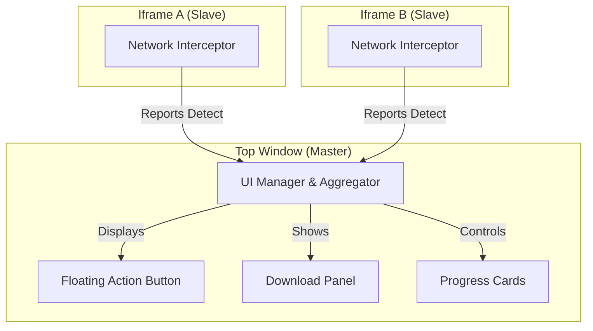

# StreamGrabber 🚀

A high-performance, lightweight userscript designed for seamless media extraction. Detect and download HLS streams (.m3u8), video blobs, and direct video files with a minimal, premium UI.

---

## 📥 Installation

> [!IMPORTANT]
> **Recommended Userscript Manager: [Violentmonkey](https://violentmonkey.github.io/)**
>
> While StreamGrabber works on most managers, **Violentmonkey** provides the best compatibility and performance for modern userscripts.

1.  **Install a manager:** [Violentmonkey](https://violentmonkey.github.io/) (Recommended)
2.  **Add Script:** Click [here](https://raw.githubusercontent.com/quantavil/userscript/main/StreamGrabber/main.js) to install.
3.  **Confirm:** Accept the installation in your browser extension.

---

## ✨ Key Features

-   **Smart HLS Processing**: Parallel segment downloading with AES-128 decryption and fMP4 support.
-   **Unified Terminal UI**: A single, clean floating action button (FAB) that manages all detected media across nested iframes.
-   **Adaptive Quality**: Automatically picks up master playlists and offers resolution selection (e.g., 1080p, 720p).
-   **Resilient Downloads**: Built-in pause/resume functionality with automatic retry mechanisms for unstable connections.
-   **Privacy First**: Minimal permissions, no external tracking, and works entirely within your browser context.

---

## 🛠 Usage

1.  **Browse**: Open any page with video content.
2.  **Detect**: The floating download button will appear once media is identified.
3.  **Choose**: Click the button to view resolutions or download directly (use **Alt+Click** for instant download if only one source is found).
4.  **Monitor**: Track progress in real-time with the compact progress cards.

---

## 🏗 Architecture: Master-Slave Pattern

StreamGrabber utilizes a robust cross-frame architecture to provide a unified experience even on complex sites with multiple embedded players.

---

## ⚙️ Advanced Controls

Access these via your userscript manager menu:
-   **Show Download Panel**: Force the UI to appear.
-   **Clear Cache**: Reset detected media for the current session.
-   **Toggle Filtering**: Exclude small segments or ads (< 1MB).

---

## 📜 Changelog

### v1.3.0
-   **HLS Enhancements**: Improved playlist enrichment and resolution detection.
-   **UI Refinement**: Cleaner animations and better responsive layout for mobile.
-   **Performance**: Optimized memory usage during large concurrent downloads.

### v1.2.5
-   **Unified UI**: Global aggregation of media from all sub-frames.
-   **Compatibility**: Enhanced support for fMP4 and diverse HLS encryption schemes.

---

## 📄 License

MIT © [quantavil](https://github.com/quantavil)
